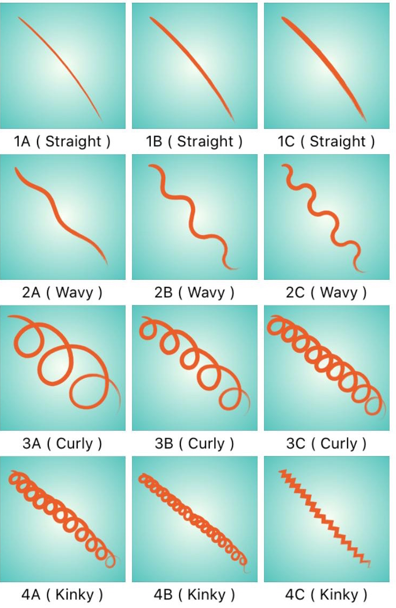

# Hair[CAM]<a href="http://hair-cam.herokuapp.com">

> Hair type prediction for better hair days

[](http://hair-cam.herokuapp.com)
[](https://www.python.org/)
[](https://github.com/Naereen/StrapDown.js/blob/master/LICENSE)
[](https://GitHub.com/Naereen/StrapDown.js/releases/)

__What's your hair type, is it straight, wavy, curly or kinky...? How loose are your curls?__

  

<!-- ## Table of Contents -->

## Project Overview

The global market for hair care products is worth over $80 B with a CAGR of 3.55%. However, navigating this space to find the right products can not only be costly but can also be daunting given the number of factors (e.g. hair type, porosity and hair styling techniques) to consider when formulating a healthy hair regimen. Hair[CAM] aims to make it easy to understand these factors, with current support for hair type recognition. To identify different hair types, Hair[CAM] uses convolutional neural networks trained on a labeled image dataset.

## Getting Started

To run Hair[CAM] locally,

### Clone 

Clone repo to local machine:

`$ git clone https://github.com/reidkr/Hair-CAM.git`

### Install

#### w/ Pip

```bash
$ pip install -r requirements.txt
$ streamlit run hair_cam.py
```

#### \w Docker

```bash
$ ./build-local.sh
$ docker run -d --name hair-cam -p 8501:8501 reidkr/hair-cam:latest
```

## Usage

> Simply upload a photo to the app and Hair[CAM] will determine your hair type

<!--  -->


#### (Optional)

To run model, independently:

```bash
$ python demo.py
```
<!-- ## Workflow summary -->

## License

[](https://github.com/Naereen/StrapDown.js/blob/master/LICENSE)

- [MIT license](https://opensource.org/licenses/mit-license.php)
- Copyright 2020 © Kemar Reid