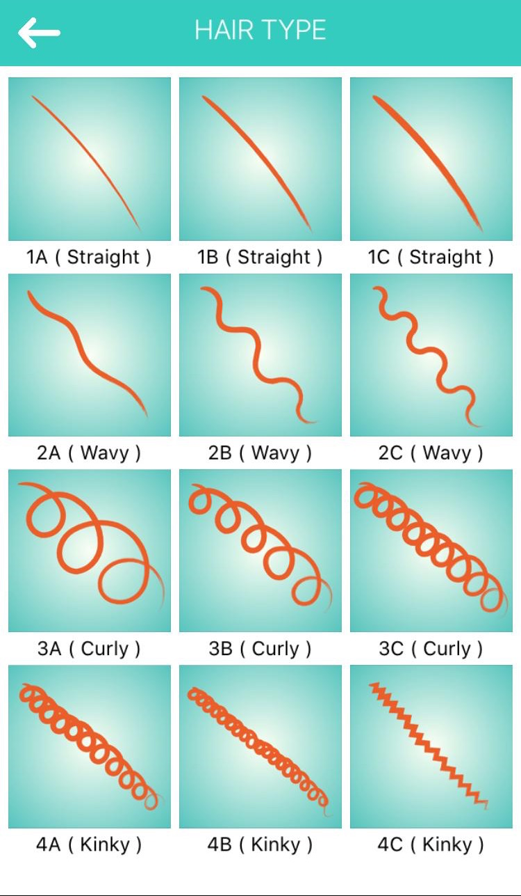

# [Hair[CAM]](http://hair-cam.herokuapp.com)

> Hair type prediction for better hair days

<!-- > Hair-CAM is a Streamlit app that uses hair data to      -->

## Table of Contents

### Project Overview

The global market for hair care products is worth over $80 B with a CAGR of 3.55%. However, navigating this space to find the right products can not only be costly but can also be daunting given the number of factors (e.g. hair type, porosity and hair styling techniques) to consider when formulating a healthy hair regimen. Hair-CAM aims to make it easy to understand these factors, with current support for hair type recognition. The system uses convolutional neural networks trained on a image dataset labeled across various hair types.

## Getting started

### Prerequisites

### Installing
 